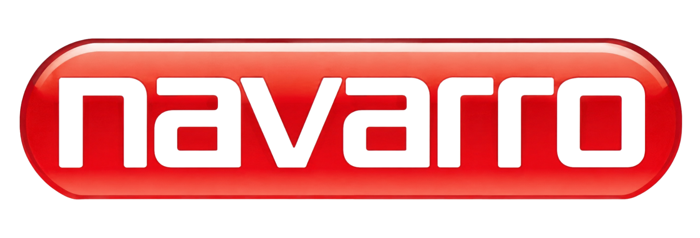

# Contexto para recriar a tela — Portal Navarro (Login, React)

Este documento é autossuficiente: contém tudo que é preciso para reconstruir
`balancas-navarro-login-react.html` do zero, byte a byte no resultado visual,
sem precisar consultar o arquivo original. Ele complementa (não substitui) o
`LAYOUT-SPEC.md`, que trata do caso de *reskin* (trocar identidade mantendo a
estrutura). Aqui o objetivo é o oposto: reproduzir esta tela **exatamente
como está hoje**, incluindo marca, cópia e assets reais.

## 1. O que é a tela

Tela de login de duas colunas para o **Portal do Agente** da Balanças
Navarro (marca industrial, 68 anos de mercado). Coluna esquerda = hero de
marca com imagem de fundo desfocada + overlay azul e lista de 3 diferenciais;
coluna direita = formulário de e-mail/senha. Abaixo de 960px o hero é
substituído por um cabeçalho compacto com a logo.

## 2. Stack técnica (contrato obrigatório)

Arquivo único autocontido, sem build step:

- `react@18.3.1` — UMD **development** build via unpkg
- `react-dom@18.3.1` — UMD **development** build via unpkg
- `@babel/standalone@7.29.0` — via unpkg, `babel.min.js`
- Script inline com `type="text/babel" data-presets="react"`
- **Não** usar `type="module"`
- Sem framer-motion (a tela não tem animação que o exija)
- Fonte: Google Fonts `Poppins` (400/500/600/700), carregada via `<link>` com
  `preconnect` para `fonts.googleapis.com` e `fonts.gstatic.com`
- `ReactDOM.createRoot(...).render(<App />)` em `#root`

```html
<script crossorigin src="https://unpkg.com/react@18.3.1/umd/react.development.js"></script>
<script crossorigin src="https://unpkg.com/react-dom@18.3.1/umd/react-dom.development.js"></script>
<script crossorigin src="https://unpkg.com/@babel/standalone@7.29.0/babel.min.js"></script>
```

## 3. Tokens (`:root` — copiar verbatim)

```css
:root{
  --bg:#ffffff;
  --surface:#f0f2f4;
  --fg:#212936;
  --muted:#637083;
  --meta:#8a94a3;
  --border:#dfe3e7;

  --accent:#b91818;
  --accent-dark:#9e1515;
  --accent-on:#ffffff;
  --accent-soft:#fbeaea;

  --green:#106a31;
  --green-soft:#e7f3ec;
  --danger:#dc2626;

  --hero-bg:#1c2d47;
  --hero-fg:#ffffff;
  --border-hover:#c3cad2;
  --btn-disabled-bg:#d8a3a3;

  --font-display:"Poppins",system-ui,-apple-system,"Segoe UI",Helvetica,Arial,sans-serif;
  --font-body:"Poppins",system-ui,-apple-system,"Segoe UI",Helvetica,Arial,sans-serif;

  --radius-sm:8px;
  --radius-md:8px;
  --radius-lg:14px;

  --shadow-card:0 4px 20px -4px rgba(33,41,54,.10);
  --shadow-card-hover:0 12px 40px -8px rgba(33,41,54,.15);
  --shadow-button:0 4px 14px -2px rgba(185,24,24,.35);

  --motion-fast:150ms;
  --motion-base:200ms;
  --ease-standard:cubic-bezier(.2,0,0,1);
}
```

Origem dos tokens: extraídos de `navarro.com.br` (ver `brand-spec.md` para
conversão HSL→hex/OKLch e evidência). Regra de disciplina: `--accent`
(vermelho institucional) aparece no máximo 2x visíveis por tela — label mono
do form + botão primário. `--green` é semântico (selo de certificação), não
conta como 2º accent.

## 4. Assets necessários (arquivos reais do projeto)

| Arquivo | Uso | Tratamento |
|---|---|---|
| `logo-navarro.png` | Logo da marca, canto superior do hero **e** no header mobile | Fundo transparente, altura 56px no hero / 40px no header mobile |
| `hero-navarro-galpao-BcRxo_pu.jpg` | Fundo do painel hero | `background-size:cover`, `filter:blur(14px) saturate(1.05)`, `transform:scale(1.08)`, coberta por overlay `linear-gradient(135deg, color-mix(...--hero-bg...))` |
| `logo-rodape-jia-sp-1.png` | Logo de parceiro/copyright no rodapé do form | `width:160px`, `height:auto`, `opacity:.7` |

Nenhuma imagem é hotlinkada por URL externa — todas ficam no diretório do
projeto e são referenciadas por caminho relativo.

## 5. Estrutura de componentes (JSX)

```
<App>                                data-od-id="login-screen"  (.screen, grid 1.05fr/1fr)
├── <HeroPanel>                      data-od-id="hero-panel"    (aside.hero)
│   ├── .hero-top
│   │   ├── .brand (data-od-id="brand-lockup") → 
│   │   └── .hero-tag → "Portal do Agente"
│   ├── .hero-mid
│   │   ├── .hero-eyebrow → "Desde 1957"
│   │   ├── .hero-title-intro → "Bem-vindo de volta ao seu"
│   │   ├── h1.hero-title → "Agente de I.A."
│   │   ├── .hero-sub → "Acesse suas ferramentas de automação inteligente, painéis de análise e insights — tudo em um só lugar."
│   │   └── .hero-features (data-od-id="hero-features") → 3× .hero-feature (ícone 40px + título + descrição, ver §6)
│   └── .hero-bottom → "© 2026 Balanças Navarro Indústria e Comércio — Todos os direitos reservados"
├── <MobileBrandHeader>              data-od-id="mobile-brand-header" (header.mobile-brand, oculto ≥960px)
│   └── 
└── <LoginForm>                      data-od-id="form-panel"    (main.panel)
    └── .form-wrap (max-width:380px)
        ├── .form-label-mono → "Acesso ao painel"
        ├── h2.form-title → "Entrar na sua conta"
        ├── <form data-od-id="login-form" noValidate>
        │   ├── .field (data-od-id="field-email") → label "E-mail" + input email + erro "Informe um e-mail válido."
        │   ├── .field (data-od-id="field-password") → label "Senha" + input password + botão toggle (data-od-id="toggle-password") + erro "A senha deve ter ao menos 8 caracteres."
        │   ├── .row-between → checkbox "Manter conectado"
        │   └── button.btn-primary (data-od-id="btn-submit-login") → "Entrar" + ícone seta (estado "Entrando..." quando submitting)
        ├── .cert-badge → ícone check + "Inovação que transforma"
        └── .form-copyright (data-od-id="form-copyright")
            ├── span.form-copyright-label → "Gerando inovação através de inteligência artificial"
            └── img src="logo-rodape-jia-sp-1.png" alt="JIA SP"
```

## 6. Conteúdo verbatim (não reescrever)

**Hero:**
- Tag: `Portal do Agente`
- Eyebrow: `Desde 1957`
- Intro: `Bem-vindo de volta ao seu`
- Título: `Agente de I.A.`
- Subtítulo: `Acesse suas ferramentas de automação inteligente, painéis de análise e insights — tudo em um só lugar.`
- Rodapé: `© 2026 Balanças Navarro Indústria e Comércio — Todos os direitos reservados`

**3 itens de `hero-features` (ícone monoline SVG stroke 1.7px, `viewBox 0 0 24 24`):**
1. Ícone raio (`IconBolt`) — título `Vantagem Competitiva` — desc `Processos mais rápidos com fluxos inteligentes.`
2. Ícone sparkle/cpu (`IconSpark`) — título `Inteligência Artificial` — desc `Impulsionando a produtividade.`
3. Ícone barras (`IconBars`) — título `Análises em Tempo Real` — desc `Acompanhe o desempenho com dashboards inteligentes.`

**Form:**
- Label mono: `Acesso ao painel`
- Título: `Entrar na sua conta`
- Campo 1: label `E-mail`, placeholder `voce@empresa.com.br`, `type="email"`, `autoComplete="username"`
- Campo 2: label `Senha`, placeholder `Sua senha`, `type` alterna `password`/`text`, `autoComplete="current-password"`, botão de olho com `aria-label` dinâmico (`Mostrar senha` / `Ocultar senha`)
- Checkbox: `Manter conectado`
- Botão primário: `Entrar` (com ícone seta) → `Entrando...` (sem ícone) quando `submitting=true`
- Selo: ícone check + `Inovação que transforma`
- Rodapé do form: `Gerando inovação através de inteligência artificial` + logo JIA SP 160px

Nenhum destes textos deve ser reescrito ao recriar a tela — são a cópia real
aprovada.

## 7. Comportamento / lógica (React state)

- `email`, `password`, `remember`, `showPassword`, `errors {email, password}`, `submitting` — todos via `useState`.
- Validação no submit (`handleSubmit`, `useCallback`, `e.preventDefault()`):
  - e-mail: regex `/^[^\s@]+@[^\s@]+\.[^\s@]+$/`
  - senha: `password.length >= 8`
  - se inválido, marca `errors` correspondente e exibe `.field-error` (mostrado via classe `.has-error` no `.field`, que também tinge a borda do input em `--danger`).
  - se válido, seta `submitting = true` (placeholder — sem endpoint real de auth ainda; comentário no código: `// Placeholder: wire to real auth endpoint.`).
- Ao digitar em um campo com erro ativo, o erro daquele campo é limpo (`onChange` reseta `errors.<campo>` para `false`).
- Toggle de senha: `showPassword` alterna `type` do input e o ícone permanece `IconEye` fixo (não há ícone de "olho riscado" separado — apenas o `aria-label` muda).
- Botão primário fica `disabled` enquanto `submitting === true`.

## 8. Responsivo

- **≥960px**: grid 2 colunas (`1.05fr 1fr`), hero visível, `.mobile-brand` oculto.
- **<960px**: `.screen` vira 1 coluna; `.hero{display:none}`; `.mobile-brand{display:flex}` com fundo `--hero-bg` e logo 40px centralizada; `.panel{padding:32px 24px}`.
- **<420px**: `.form-title` reduz de 30px para 24px.

## 9. Acessibilidade / estados de interação

- Todo elemento focável tem `:focus-visible` claro: inputs usam `box-shadow:0 0 0 3px var(--accent-soft)` + borda `--accent`; botões usam `outline:2px solid var(--accent)` (toggle de senha, checkbox) ou `outline:2px solid var(--fg)` (botão primário, para contraste sobre o vermelho).
- Hover do botão primário escurece o vermelho (`--accent` → `--accent-dark`), nunca clareia.
- Hover do botão de mostrar/ocultar senha usa `--surface` de fundo + `--fg` de texto (nunca texto mais claro).
- Texto sobre o hero (`--hero-fg` branco) mantém contraste alto sobre o overlay azul-marinho (`--hero-bg` com opacidade 68–85% via `color-mix`).
- `data-od-id` presentes em todas as regiões, CTAs e campos nomeados na árvore do §5, para permitir referência direta em revisões futuras.

## 10. Passo a passo para reconstruir do zero

1. Criar arquivo único `.html`, `lang="pt-BR"`, `<title>Portal Navarro — Entrar (React)</title>`.
2. Carregar Google Fonts Poppins + os 3 scripts CDN do §2.
3. Colar o bloco `:root` do §3 dentro de um `<style>` único no `<head>`.
4. Escrever o CSS de componentes seguindo as classes referenciadas no §5
   (`.screen`, `.hero`, `.hero-top/-mid/-features/-bottom`, `.mobile-brand`,
   `.panel`, `.form-wrap`, `.field`, `.toggle-visibility`, `.row-between`,
   `.btn-primary`, `.cert-badge`, `.form-copyright`) e os breakpoints do §8.
5. Copiar os 3 assets do §4 para o mesmo diretório do arquivo HTML.
6. Escrever o JSX inline (`type="text/babel"`) com os componentes
   `HeroPanel`, `MobileBrandHeader`, `LoginForm`, `App`, usando o conteúdo
   verbatim do §6 e a lógica do §7.
7. Montar com `ReactDOM.createRoot(document.getElementById("root")).render(<App />)`.
8. Validar: nenhum hex fora do `:root`, um único CTA sólido por tela, foco
   visível em todo elemento interativo, sem overlap entre hero e conteúdo.

## 11. Diferença em relação ao `LAYOUT-SPEC.md`

- `LAYOUT-SPEC.md` documenta o arquivo **HTML puro** (`balancas-navarro-login.html`) como template para **trocar de marca** — nele os textos e a marca são variáveis.
- Este arquivo (`LOGIN-SCREEN-CONTEXT.md`) documenta a versão **React**
  (`balancas-navarro-login-react.html`) como está **hoje**, com a marca,
  cópia e assets da Navarro fixos — use-o quando o objetivo for reproduzir
  esta tela exata, não uma variação de marca.
